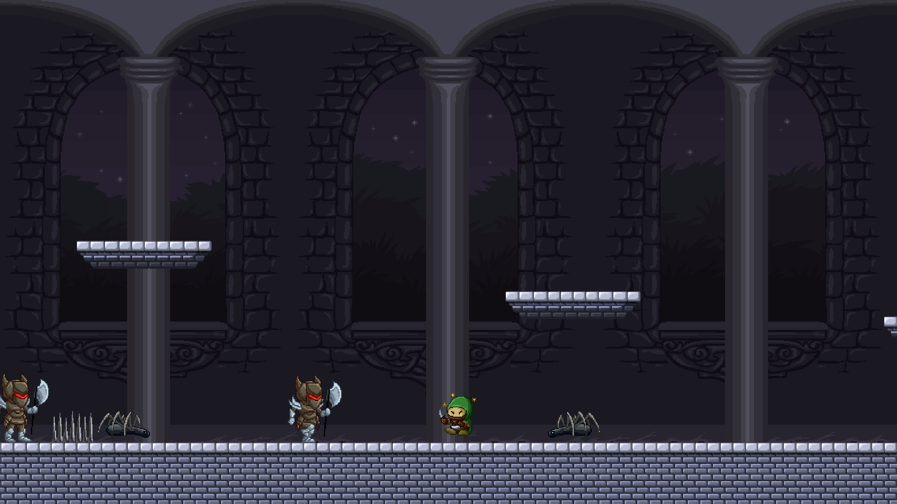
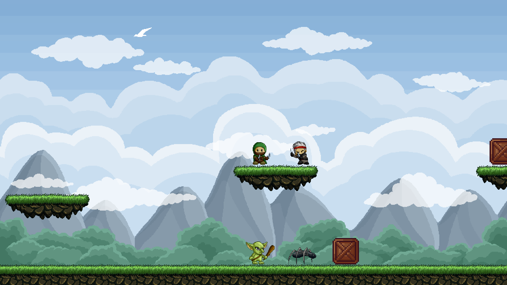
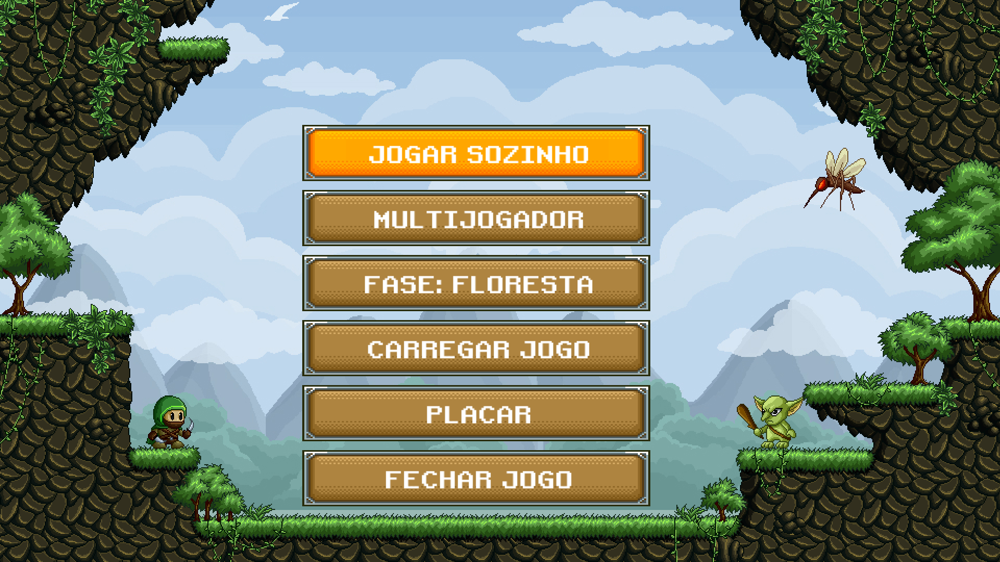
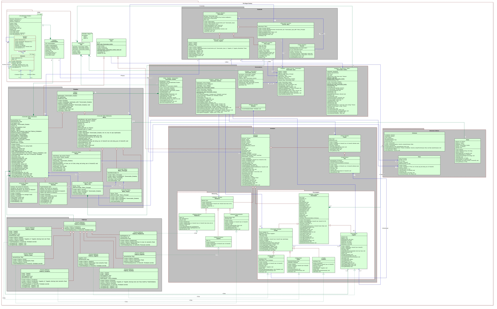

# The Rogue Fantasy
A **2D medieval fantasy platformer** developed in **C++** using the **SFML Graphics Library**. Play as a rogue, defeat enemies, collect points, and advance through challenging levels!

  

## 🛠️ Features  
- **Single & Multiplayer**: Play solo or with a friend in cooperative mode.  
- **Dynamic Combat**: Attack enemies with a dagger, evade obstacles, and push objects.  
- **Challenging Enemies**: Goblins, spiders, and knights with unique behaviors.  
- **Diverse Levels**: Forest and castle environments with obstacles like spikes and platforms.  
- **Game Menus & Save System**: Main menu, leaderboard, pause menu, and game-saving functionality.  

  

## 🚀 Installation & Running  
### **Prerequisites**  
- C++ compiler (GCC, Clang, or MSVC)  
- CMake  
- SFML library

### **Building the Game**  
1. **Clone the repository**  
   ```sh
   git clone https://github.com/vNemetz/The-Rogue-Fantasy.git
   cd The-Rogue-Fantasy
   ```
2. **Build using CMake**  
   ```sh
   mkdir build && cd build
   cmake ..
   make
   ```
3. **Run the game**  
   ```sh
   ./The-Rogue-Fantasy
   ```
  
### Tested Configurations

The game was tested and verified on the following system configuration:

- Operating System: Arch Linux 6.13.1  
- Compiler: GCC 14.2.1  
- CMake: 3.31.5  
- Graphics Library: SFML 2.6.2  

⚠️ Other configurations may work but have not been tested.  

  

## 🏗️ Development Overview  
The game follows **Object-Oriented Programming (OOP) principles**, utilizing **UML (Unified Modeling Language) diagrams** to guide architecture and implementation. It also applies **design patterns** from *"Design Patterns" by Erich Gamma et al.*. Key components include:  

### **🛠️ Core Architecture**  
- **Game Engine**: Central `Jogo` class managing all subsystems.  
- **Managers Package**: Handles graphics, collisions, inputs, states, and events.  
- **Entities Package**: Abstract entity class with characters, obstacles, and projectiles.  
- **Characters Package**: Player and enemy AI with unique attack/movement mechanics.  
- **Levels Package**: Procedural entity generation using **Factory Method**.  
- **Menu System**: Interactive UI with buttons and text inputs using **Observer Pattern**.  

### **🧠 Design Patterns Used**
✅ **Singleton** – Ensures a single instance for managers like graphics, input, and state handling.  
✅ **Mediator** – Collision handling without tight coupling.  
✅ **Observer** – Input management and UI updates.  
✅ **State** – Managing game states (levels, menus, etc.).  
✅ **Factory Method** – Dynamic object creation.  
✅ **Iterator** – Efficient entity list traversal.

### **UML Diagram**
  

## 👨‍💻 Authors  
- **Gabriel Affonso Borges Caballero**  
- **Vinícius Nemetz Grabovski**  

## 📜 Acknowledgments  
This project was developed as part of the **Programming Techniques** (Object-Oriented Programming) course at **Federal University of Technology - Paraná**, guided by **Prof. J. M. Simão**.


Made by Gabriel Borges and Vinícius Nemetz.  
All the code written here was entirely engineered by the authors.
